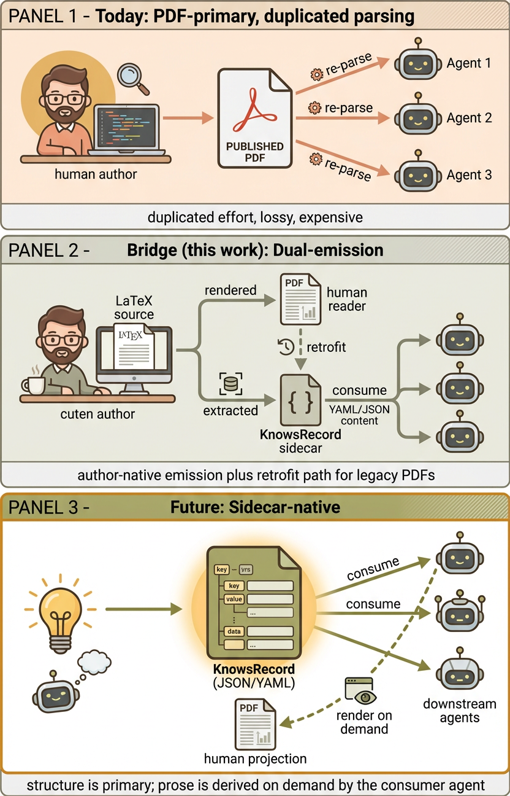

#  Knows: Make Any Paper Agent-Ready in Minutes

English | [中文](./README.zh.md)

> **One YAML file. Every claim, every number, every connection — structured, validated, and ready for your AI agent.**

[](src/knows_sidecar/schema/knows-record-0.9.json)
[]()
[]()
[](https://knows.academy)
[](LICENSE)

---

```bash
npx skills add OniReimu/Knows
```

Then ask your agent: *"find papers about transformers"*, *"summarize this paper"*, *"what's the main contribution?"*

<p align="center">
  
</p>

## Why Knows Exists

Academic publishing is an ivory tower still pretending it's 1995.

We train researchers to write eight-part-essay papers in a format optimized for human eyeballs — and then we feed those same PDFs to AI agents that have to reverse-engineer the structure from prose. Every agent, every time, independently extracts claims, maps evidence to assertions, and resolves citation targets from the same unstructured text. It's lossy, it's duplicated, and it's absurd.

Meanwhile, agents are already the primary interface for consuming research. They review papers, they search literature, they synthesize findings. We are past the point where it makes sense to have humans write natural language for other humans, only to have machines re-parse it.

**The information flow should be inverted.** Content should be authored in the most efficient, structured, token-minimal form — optimized for agents. When a human needs to read it, the agent translates it into natural language. Not the other way around.

That's why we built **Knows**.

Not another paper-writing tool. Not another PDF parser. A **companion standard** that puts structured knowledge first and lets the format serve whoever — or whatever — is reading it.

---

## What is Knows?

**Knows** is a YAML sidecar that sits next to your PDF — the structured, agent-native representation of everything your paper claims, proves, and connects:

```
paper.pdf          ← Human artifact (unchanged)
paper.knows.yaml   ← Agent-facing companion
```

Schema-validated. Version-chained. 77% fewer tokens than PDF. No changes to the published artifact required.

```yaml
# paper.knows.yaml
$schema: https://knows.dev/schema/record-0.9.json
knows_version: 0.9.0
profile: paper@1
title: "Deep Residual Learning for Image Recognition"

statements:
  - id: stmt:c1
    statement_type: claim
    modality: empirical
    text: "ResNets achieve 3.57% top-5 error on ImageNet"
    confidence:
      claim_strength: high
      extraction_fidelity: high

evidence:
  - id: ev:imagenet
    evidence_type: table_result
    observations:
      - metric: top5_error
        value: 3.57
        unit: "%"

relations:
  - id: rel:1
    subject_ref: stmt:c1
    predicate: supported_by
    object_ref: ev:imagenet
```

<p align="center">
  
</p>

---

## Installation

### For agent users (recommended)

```bash
# Claude Code, project-level
npx skills add OniReimu/Knows -a claude-code -s '*' -y

# Claude Code, global (across all projects)
npx skills add OniReimu/Knows -g -a claude-code -s '*' -y

# Codex CLI
npx skills add OniReimu/Knows -a codex -s '*' -y

# Both Claude Code and Codex
npx skills add OniReimu/Knows -a claude-code -a codex -s '*' -y

# Every supported agent (50+)
npx skills add OniReimu/Knows --all
```

The `npx skills` CLI is provided by [vercel-labs/skills](https://github.com/vercel-labs/skills) and supports 50+ agents. The flags above target a specific agent and skip the interactive picker.

### For sidecar authors (Python CLI)

If you're a paper author writing your own sidecar, install the Python package:

```bash
pip install knows-sidecar
# or
uv add knows-sidecar
```

This gives you `knows gen` (LaTeX → sidecar scaffold), `knows lint` (validate), `knows query` (ask a question grounded in the sidecar), and a few more. See [Quick Start](#quick-start) for the author workflow.

---

## Quick Start

### As an agent user

After installing the skill (above), just talk to your agent in natural language:

- **Find papers**: *"find me 5 papers on diffusion models"*
- **Summarize**: *"summarize this paper for me"* (paste a `paper.knows.yaml` or PDF)
- **Compare**: *"compare these two papers — what's different?"*
- **Brainstorm gaps**: *"what's underexplored in side-channel ML attacks?"*
- **Draft a review**: *"help me prep a review of this paper"*

The agent picks the right Knows sub-skill from your phrasing. See [What Your Agent Can Do](#what-your-agent-can-do) for the full menu.

### As a sidecar author

If you're publishing a paper and want to ship a sidecar with it:

```bash
# 1. Generate scaffold from your LaTeX source
knows gen paper/main.tex -o paper.knows.yaml

# 2. Fill in TODOs (about 15 minutes for an experienced user)

# 3. Validate
knows lint paper.knows.yaml

# 4. (Optional) Test by querying it
knows query paper.knows.yaml "What is the main contribution?"
```

For full CLI reference, run `knows --help`.

---

## What Your Agent Can Do

Knows ships **12 sub-skills** (find / read / write / compare / review / brainstorm / draft rebuttal / generate sidecar / inspect versions / advise next steps / build commentary / patch metadata) and **11 interaction stances** (devil's advocate, socratic, red-team, executive summary, paper brainstorm, draft grill, ...).

Sub-skills emit schema-validated artifacts (a sidecar, a ranked paper list, a peer review, etc.). Stances trigger thinking postures (let's debate this, ask me questions, find weak spots) and chain into sub-skills via fenced YAML handoff.

→ **See [the full skills catalog](./skills/README.md)** for what each one does, when it activates, and how they compose.

---

## How It Works

### KnowsRecord schema (v0.9)

A KnowsRecord is a YAML file living next to a paper PDF. It binds **statements** (claims / methods / limitations / questions / reflections / lessons), **evidence** (numbers, sources, supports), **typed relations** (one statement supports / refutes / extends another), **artifacts** (datasets, code, models referenced), and **provenance** (who wrote each part, when, and how).

```
KnowsRecord
  ├─ artifacts[]        paper, repository, dataset, model, benchmark, software, website, other
  ├─ statements[]       claim | assumption | limitation | method | question | definition
  │   modality:         empirical | theoretical | descriptive | normative
  │   confidence:       claim_strength × extraction_fidelity
  ├─ evidence[]         table_result | figure | experiment_run | proof | case_study | observation | ...
  │   observations[]:   value (numeric) OR qualitative_value (string)
  ├─ relations[]        supported_by | challenged_by | depends_on | limited_by | cites
  ├─ actions[]          optional executable hooks with safety policy
  ├─ provenance         origin, actor, method, verification
  ├─ replaces           record_id of previous version (version chain)
  ├─ version            spec × record × source
  └─ freshness          as_of, update_policy, stale_after
```

30 root-level fields, 23 entity definitions, extensible via `x_extensions`. For full examples, see the [examples directory](./examples/).

### Orchestrator + dispatch

The orchestrator routes user intent through a typed tuple `(intent_class, required_inputs, requested_artifact)` to one of the 12 sub-skills. **7 guards (G1-G7)** protect against prompt injection, profile contamination, quality leakage, and unbounded fetches. The full contract lives in [skills/references/dispatch-and-profile.md](./skills/references/dispatch-and-profile.md).

<p align="center">
  
</p>

### Two operating modes

| Mode | When to use | What happens |
|---|---|---|
| **Knows-only** (agent-native) | You have the sidecar | Agent reads only the YAML — fast, deterministic, low-token |
| **Knows + PDF fallback** (hybrid) | Cold start, sidecar incomplete | Agent reads the YAML AND falls back to the PDF when the sidecar lacks coverage |

The default is Knows-only. Fallback activates automatically when the sidecar reports `coverage_statements: partial` or when the agent's query requires evidence the sidecar doesn't bind.

---

## Evaluation

Across 11 experiments (E1-E10) on 20 papers, 14 disciplines, and 8+ LLM agents:

- **+29 to +42 percentage points** accuracy for weak models (Qwen-0.8B, Gemma-2B) when given a sidecar vs PDF alone
- **55% fewer tokens** to reach the same accuracy as full-PDF reading
- **0% → 64-91% traceability** — sidecars bind every claim to evidence; PDFs bind nothing
- **14 disciplines covered** — from CS / ML to economics, biology, civil engineering

→ **See [docs/evaluation.md](./docs/evaluation.md)** for the full results table, length-effect breakdown, scoring robustness, and per-experiment details.

---

## Citation

```bibtex
@misc{yu2026knowsagentnativestructuredresearch,
      title={Knows: Agent-Native Structured Research Representations}, 
      author={Guangsheng Yu and Xu Wang},
      year={2026},
      eprint={2604.17309},
      archivePrefix={arXiv},
      primaryClass={cs.AI},
      url={https://arxiv.org/abs/2604.17309}, 
}
```

## License

Apache License 2.0 — see [`LICENSE`](LICENSE).

Copyright 2026 The Knows Authors. Licensed under the Apache License, Version 2.0.
